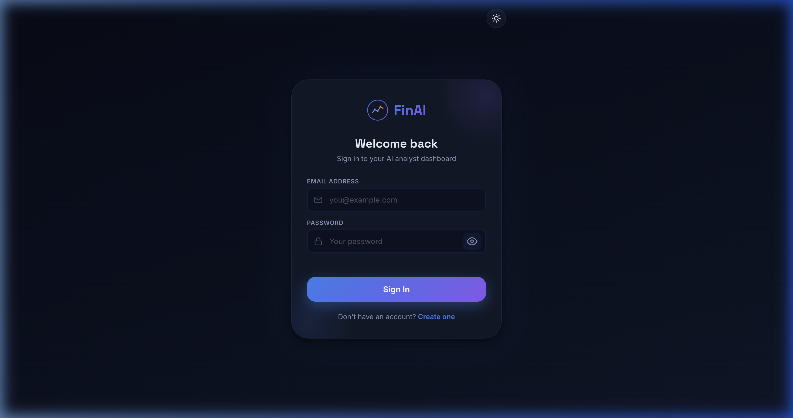
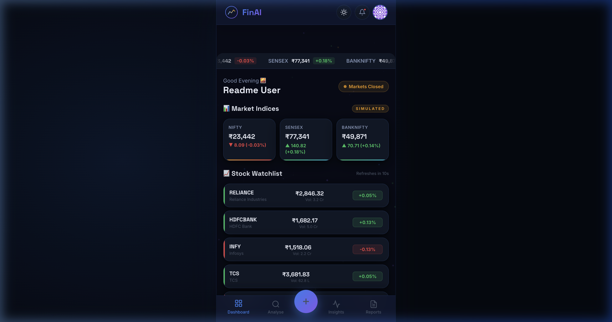
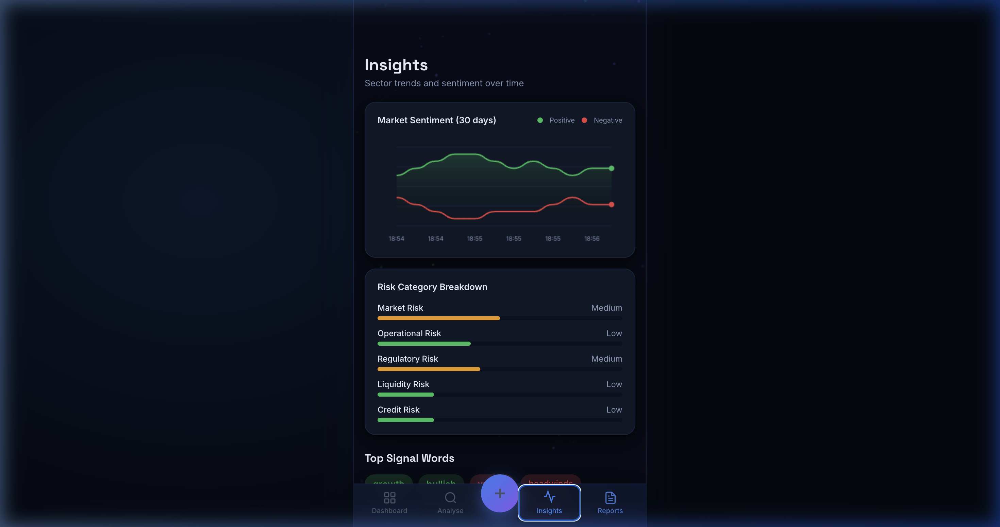
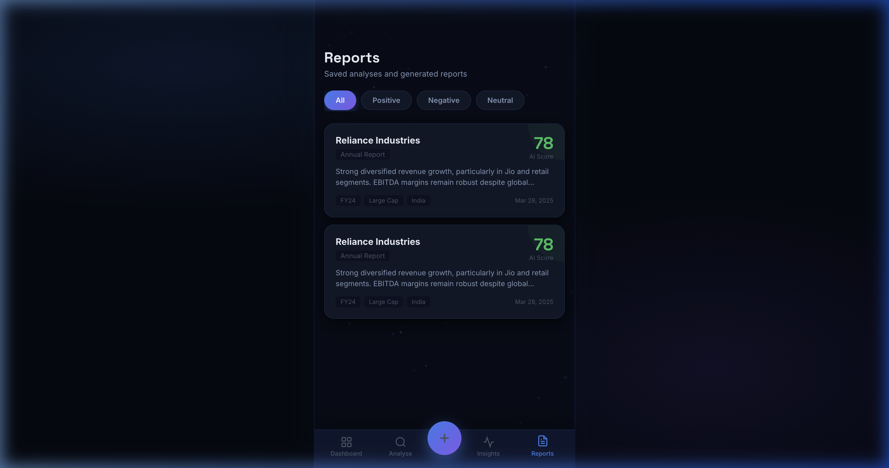

<div align="center">
  
  <h1>FinAI — AI Financial Analyst</h1>
  <p>A modern, interactive, and beautifully designed web application for AI-driven financial insights, stock tracking, and document sentiment analysis.</p>
</div>

---

## 📸 Screenshots

| Sign In & Registration | Real-Time Dashboard |
| :---: | :---: |
|  |  |

| Deep Insights & Sentiment | Real-Time Market Reports |
| :---: | :---: |
|  |  |


## ✨ Features

- **Secure Authentication:** Firebase Email/Password authentication with automatic Gravatar profile integration.
- **Dynamic Real-Time Data:** Live stock price tickers, market indices (NIFTY, SENSEX), and company sector performance powered by real-time JavaScript event loops.
- **AI Analysis Engine Simulation:** Stunning step-by-step progress UI depicting FinBERT NLP tokenization, risk extraction, and sentiment scoring.
- **Light & Dark Mode:** Completely responsive, theme-switchable UI with glassmorphic accents, particle backgrounds, and modern micro-animations.
- **Data Persistence:** Automatic seeding of market analyses directly to a secure Firebase Firestore database.
- **Secure Deployment:** Built-in GitHub Actions CI/CD to prevent API key leaks and auto-deploy to GitHub Pages.

## 🛠 Tech Stack

- **Frontend:** Vanilla HTML5, CSS3, JavaScript (ES modules)
- **Backend/BaaS:** Firebase Authentication & Cloud Firestore (v10.12 Web SDK)
- **Icons & APIs:** Gravatar Web API, inline custom SVGs
- **Deployment:** Vercel (Optimized Vite Build)

## 🚀 Setting Up Locally

If you want to run this application on your local machine:

1. **Clone the repository:**
   ```bash
   git clone https://github.com/MohitG780/FinAi.git
   cd FinAi
   ```

2. **Install Dependencies:**
   ```bash
   npm install
   ```

3. **Create your Environment Variables:**
   Create a `.env` file in the root directory and add your Firebase configurations:
   ```env
   VITE_FIREBASE_API_KEY=your_api_key
   VITE_FIREBASE_AUTH_DOMAIN=your_auth_domain
   VITE_FIREBASE_PROJECT_ID=your_project_id
   VITE_FIREBASE_STORAGE_BUCKET=your_storage_bucket
   VITE_FIREBASE_MESSAGING_SENDER_ID=your_messaging_sender_id
   VITE_FIREBASE_APP_ID=your_app_id
   VITE_FIREBASE_MEASUREMENT_ID=your_measurement_id
   ```
   *Note:* Replace the placeholder variables with your active Firebase project settings. Make sure **Email/Password** Auth and **Firestore Database** are enabled in your console.

4. **Serve the Application:**
   Start the Vite development server:
   ```bash
   npm run dev
   ```
   *Navigate to `http://localhost:5173` (or the URL shown in your terminal) to start analyzing!*

## 🌐 Deployment (Vercel)

This project is configured to be seamlessly deployed via Vercel using the optimized Vite build output.

1. Create a new project on [Vercel](https://vercel.com/) and import your repository.
2. In the "Environment Variables" section before deploying, add all the `VITE_FIREBASE_*` variables from your `.env` file.
3. The build command will automatically run `npm run build` and the output directory will be `dist`.
4. Deploy to production. Future pushes to the `main` branch will automatically trigger production deployments.

## 🛡️ Security Note

The `.env` file containing API keys is added to `.gitignore`. Never commit your real API keys directly to the public repository. Use your hosting provider's environment variables dashboard (e.g., Vercel) to configure your secrets securely.
